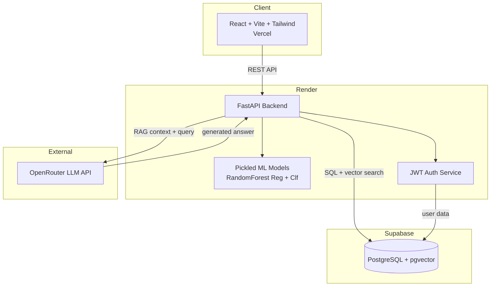

# System Architecture

```mermaid
flowchart TB
    subgraph Client
        FE[React + Vite + Tailwind<br/>Vercel]
    end
    subgraph Server[Render]
        API[FastAPI Backend]
        ML[Pickled ML Models<br/>RandomForest Reg + Clf]
        AUTH[JWT Auth Service]
    end
    subgraph Data[Supabase]
        PG[(PostgreSQL + pgvector)]
    end
    subgraph External
        LLM[OpenRouter LLM API]
    end

    FE -->|REST API| API
    API --> ML
    API --> AUTH
    API -->|SQL + vector search| PG
    API -->|RAG context + query| LLM
    LLM -->|generated answer| API
    AUTH -->|user data| PG
```
