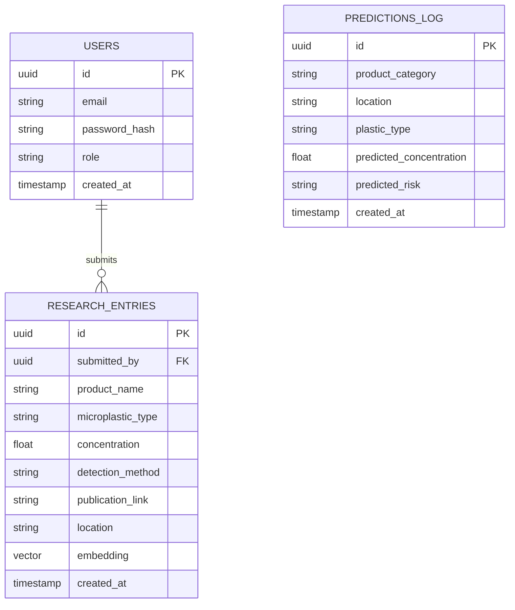

# ER Diagram

```mermaid
erDiagram
    USERS {
        uuid id PK
        string email
        string password_hash
        string role
        timestamp created_at
    }
    RESEARCH_ENTRIES {
        uuid id PK
        uuid submitted_by FK
        string product_name
        string microplastic_type
        float concentration
        string detection_method
        string publication_link
        string location
        vector embedding
        timestamp created_at
    }
    PREDICTIONS_LOG {
        uuid id PK
        string product_category
        string location
        string plastic_type
        float predicted_concentration
        string predicted_risk
        timestamp created_at
    }
    USERS ||--o{ RESEARCH_ENTRIES : submits
```
